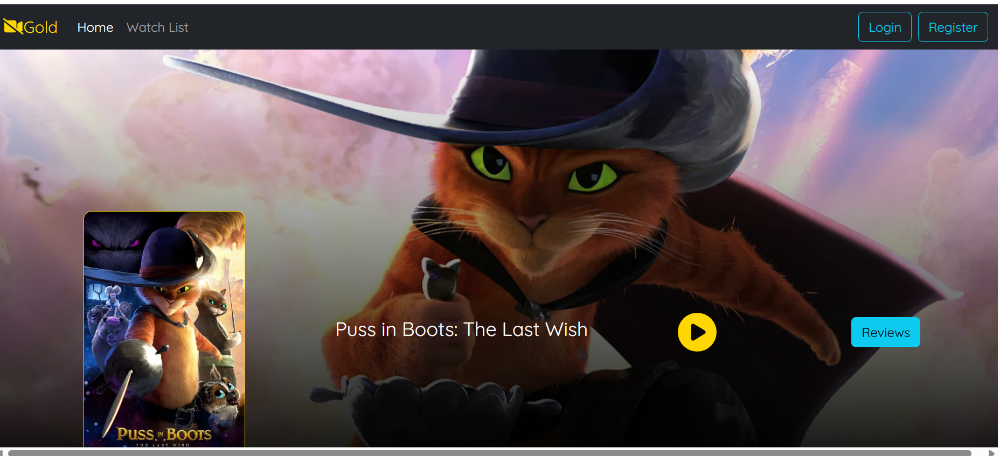

#  Netflix Clone – Full Stack Deployment on AWS

##  Overview
This is a full-stack movie streaming application deployed on AWS EC2.

It demonstrates how frontend, backend, and database work together in a real-world environment.

---

##  Architecture
Frontend (React) → Backend (Spring Boot) → MongoDB

---

##  Tech Stack
- React.js
- Spring Boot (Java)
- MongoDB Atlas
- AWS EC2 (Ubuntu)
- Linux (SSH, systemd)

---

##  Deployment Steps
1. Created EC2 instances for frontend and backend
2. Connected via SSH
3. Installed Node.js, Java, Maven
4. Deployed backend and connected MongoDB
5. Built frontend using:
   npm run build
6. Served frontend using:
   serve -s build -l 3000
7. Connected frontend to backend API

---

##  Live Demo
http://3.70.217.28:3000

---

##  Challenges & Solutions
- Fixed MongoDB connection issues  
- Resolved API 404 errors  
- Added swap memory for EC2  
- Configured systemd for persistent running

## 📸 Screenshots

###  Application UI

###  Frontend Running on EC2

###  Backend Running (Spring Boot)

###  AWS EC2 Instance

###  MongoDB Atlas

- 

---

##  Key Learnings
- Cloud deployment with AWS  
- Debugging real-world issues  
- Full-stack integration  
- Linux server management
